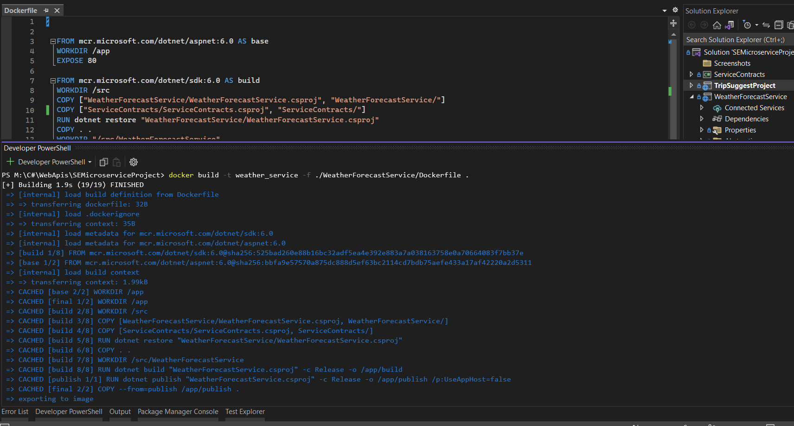
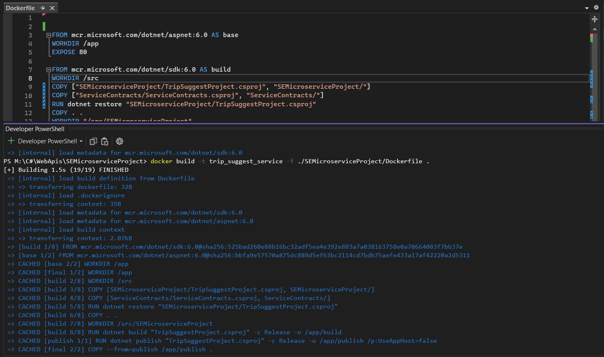

# SEMicroserviceProject
| Fullname | StudentNumber|
| -------- | ------------ |
| Alireza Eiji | 98101193 |
| Shayan Talaei | 98109548 |

در این آزمایش قرار است که به بررسی معماری میکروسرویس بپردازیم و دو میکروسرویس بالا آورده و با داکر آنها را کانتینتری کنیم.

در کل دو سرویس موجود است یکی سرویس برای بررسی آب و هوا که اسم یک شهر به آن داده میشود و آب و هوا و دما برگردانده میشود.

یکی هم سرویس برای پیشنهاد مسافرت که باز هم اسم شهر داده میشود و اطلاعات شهر از جمله آب و هوا برگردانده میشود.

همان طور که مشخص است سرویس دوم یعنی پیشنهاد مسافرت به سرویس اول وابسته است و این وابستگی از نوع domain coupling میباشد.

پس از آن که جفت سرویس ها را نوشته و داکرفایل آنها را درست کردیم به سراغ build کردن image آن ها میرویم.

